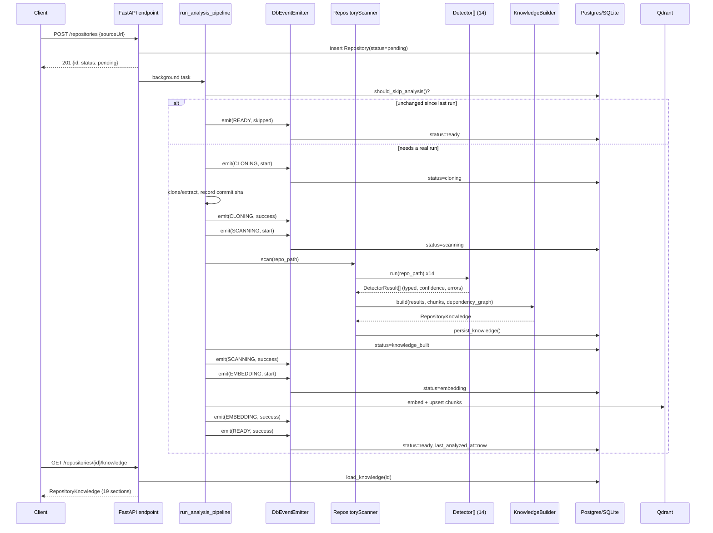

# RepoMind AI — Architecture

This document covers the **Repository Intelligence layer**: how a submitted repository becomes a
canonical `RepositoryKnowledge` object, and why every future consumer (chat, search, reports,
agents) reads *only* that object instead of the repository on disk. See [README.md](README.md) for
the product overview and [SETUP.md](SETUP.md) for running it locally.

## Pipeline overview

```
GitHub URL / ZIP upload
        │
        ▼
 POST /repositories  ──  creates a Repository row (status=pending), schedules a background task
        │
        ▼
 run_analysis_pipeline()  ──  the orchestrator (app/services/repository/analysis_pipeline.py)
        │
        ├─ should_skip_analysis()?  ── incremental short-circuit (see below) ── skip straight to READY
        │
        ▼
 CLONING        clone/extract, record the git commit sha (for future incremental checks)
        ▼
 SCANNING       every Detector runs against the repo path, tree-sitter parses source,
                the import graph is built, results are typed + confidence-scored
        ▼
 KNOWLEDGE_BUILT  Knowledge Builder assembles the 19-section RepositoryKnowledge object
                  (one best-effort LLM call fills in judgment fields only), persisted to the DB
        ▼
 EMBEDDING      semantic knowledge chunks are re-derived from the persisted
                 report, checksum-skipped, and embedded into Qdrant
        ▼
 READY  (or FAILED, from any stage, with the error recorded on the Repository row)
```

Every arrow is an isolated, typed step. Nothing deterministic is left to the LLM — languages,
frameworks, dependencies, Docker/CUDA/CI-CD/deployment/testing/API/database signals are all
extracted by dedicated detectors; the LLM only fills in judgment fields (architecture summary, use
cases, production readiness, difficulty, performance notes) that genuinely can't be derived
mechanically.

## Sequence diagram



## Class diagram


## Detector interface

Every detector (`app/services/repository/detectors/base.py`) implements one method, `detect(repo_path) -> T`
(a small Pydantic model specific to that detector), and inherits `run()` for free — which wraps the
result (or a captured error + safe default, if `detect()` raises) in a `DetectorResult[T]` envelope
carrying `detector_name`, `detector_version`, `confidence`, `detected_at`, and `errors`. 14 detectors
implement this: the original 7 (language, framework, dependency, package-manager, docker, cuda,
security) plus the README parser and 6 new lightweight ones (CI/CD, deployment, testing, API
surface, database, quality) — all reusing stdlib/regex/file-presence checks, no new dependency.

## Lifecycle

`RepositoryStatus`: `PENDING → CLONING → SCANNING → KNOWLEDGE_BUILT → EMBEDDING → READY`, or
`FAILED` from any stage. SCANNING and KNOWLEDGE_BUILT are one atomic unit of work in the current
in-process implementation (detector-running and knowledge assembly happen together, no LLM
streaming between them) — splitting them into two separately-dispatched stages would mean running
every detector twice just to get a status flicker, so the scanning stage makes one direct status
transition to `KNOWLEDGE_BUILT` right before returning, once persistence has actually happened. Both
statuses are still real, observed transitions backed by a single pass of work.

## Event-driven pipeline & the Celery/Redis extension point

`app/services/repository/pipeline/` decouples *what* each stage does from *how* it's dispatched:

- `StageDef` — a `(RepositoryStatus, run_fn)` pair. `run_fn` takes only `(repository_id, settings)`
  and opens its own DB session — no shared mutable state (no live `Session`/LLM `Runnable`) crosses
  a stage boundary, since those can't survive a future process/queue hop but `repository_id`/
  `Settings` can.
- `StageRunner` — the extension seam. `InProcessRunner` (today's only implementation) just calls
  `stage_def.run(...)` directly. A future `CeleryStageRunner.dispatch()` would do
  `celery_task.delay(...).get()` instead — **zero changes** to `PIPELINE`, any stage body, or
  `RepositoryStatus` are needed to make that swap.
- `EventEmitter` — `DbEventEmitter` is the sole implementation (one consumer exists; a listener
  registry is added only when a second one, e.g. a WebSocket push, is real). It updates
  `Repository.status`/`last_error`/`last_error_stage` and logs with `extra={repository_id, stage}` —
  the full "structured logging" ask, no new logging dependency for a single process with no
  aggregator yet.

One honest gap, deliberately not solved now: SCANNING's tree-sitter chunks are needed again by
EMBEDDING. Rather than passing them in-memory (which wouldn't survive a real queue boundary),
EMBEDDING re-derives them via `TreeSitterParser.parse(repo_path)` — cheap, deterministic, local CPU
— so the stage boundary is real *today*, not a "fix when we adopt Celery" TODO.

## Semantic Knowledge Index (the embedding stage)

The milestone rule is "never embed files, embed knowledge": the EMBEDDING stage turns the
persisted `RepositoryKnowledge` report into semantic chunks — small, self-contained statements of
*meaning* ("API: POST /login (api/auth.py) requires auth", "File: api/auth.py imports flask,
bcrypt") — not raw source slices. Everything lives under `app/services/knowledge/`:

- **ChunkBuilder** (`chunk_builder.py`) — the only place knowledge becomes chunks. ~17 typed
  facets (summary, architecture, folder, file, api_endpoint, database, orm, framework, dependency,
  docker, cuda, cicd, deployment, testing, documentation, performance, security, quality) with an
  importance weight per type. Ids are deterministic `sha1(repository_id|type|title)` and checksums
  are `sha1(content+metadata)`, so identical re-runs skip; titles carry their file
  (`API: GET / (tests/test_basic.py)`) so the same route defined in several files can't collapse
  into one chunk, plus a last-resort counter suffix. Relationships (contains / defined_in / uses /
  depends_on / part_of / relates_to) are wired in a second phase once every chunk id exists, so
  edges never depend on build order; at most six edges survive into Qdrant as payloads.
- **EmbeddingService** (`embedding_service.py`) — batched (32) upsert of vectors; skips chunks
  whose stored checksum matches (refreshing their run id), re-embeds changed ones (version bump),
  and sweeps points that vanished — add-then-delete, so a failure mid-run leaves the previous
  index intact. Stale Phase 2 file-chunk points (payloads without a `chunk_id`) are swept too.
- **KnowledgeRetriever** (`retriever.py`) — `semantic_search` (pure vector), `hybrid_search`
  (dense + a keyword-constrained dense leg, fused with local reciprocal-rank fusion — the bundled
  qdrant-client is too old for server-side fusion), `context_search` (semantic hit + its one-hop
  related chunks), plus `list_chunks` / `stats` / `get_chunk`. Ollama/nomic-embed-text is the
  default embedding provider (see `SETUP.md`); local Qdrant mode needs no server.

Search reads hit only the vector index — nothing re-parses the repository. The frontend
Knowledge Explorer (`frontend/src/pages/RepositoryPage.tsx`) renders the stats grid, the search
box with a semantic/hybrid toggle, category filters, and the paginated chunk list.

## Incremental re-analysis

Checked once, before the expensive clone: for git sources, a cheap `git ls-remote` (no clone)
compared against the commit sha recorded on the last successful run; for zip uploads, the sha256
computed at upload time compared against the stored hash. Any uncertainty (no prior run, remote
unreachable) means "run it fully" — never "skip". `POST /repositories/{id}/reanalyze?force=true`
bypasses the check entirely, for the case where the repo hasn't changed but a detector has (the
original motivating use case for the reanalyze endpoint). Deferred as future work: per-file
diff-based partial rescanning, incremental import-graph updates, chunk-level Qdrant diffing — all
need per-file hashing and a real diff algorithm, not justified until reanalysis volume is an actual
measured pain point.

## Database: normalized where it's actually queryable, JSON(B) where it's flexible

`languages`, `frameworks`, `dependencies` get real child tables (`repository_languages`,
`repository_frameworks`, `repository_dependencies`) — these are naturally many-to-one and
genuinely worth filtering/joining on later ("find every repo using Flask"). Every other section
(architecture, files, symbols, imports, apis, databases, docker, cicd, deployment, testing,
documentation, performance, security, quality) is one JSON(B) column on `repository_knowledge`,
round-tripped via that section's own `model_dump()`/`model_validate()` — their internal shape varies
too much to be worth a dedicated table yet, and 19 child tables for one refactor pass would be
premature normalization for facets nothing queries relationally today.

Those JSON(B) columns use `JSON().with_variant(JSONB, "postgresql")`: real `JSONB` (indexable,
queryable via `->>`) the moment `DATABASE_URL` becomes a Postgres DSN, plain `JSON` on SQLite today
— zero code change either way. **The DB is SQLite by default right now** (zero-setup dev, per
`app/core/config.py`), not Postgres — this refactor makes the schema Postgres-ready without forcing
that migration; flip `DATABASE_URL` whenever you're ready.

## Analysis observability: runs, events, detector results, metrics

The pipeline now stores its *trace*, not just its final output (`app/models/orm/analysis.py`,
written by `app/services/repository/pipeline/{events,runs}.py`):

- **`analysis_runs`** — one row per pipeline invocation, created by the orchestrator before it
  dispatches the first stage and flipped to `completed` / `failed` / `skipped` afterwards, with
  trigger (`create` | `reanalyze` | `forced`), commit sha, and duration. `GET
  /repositories/{id}/analysis` returns the history.
- **`analysis_events`** — an append-only log of milestone events (`AnalysisStarted`,
  `RepositoryCloned`, `DetectorStarted`, `DetectorCompleted`, `KnowledgeBuilt`,
  `KnowledgeStored`, `AnalysisCompleted`, `AnalysisFailed`, `AnalysisSkipped`) plus the
  stage-level events (`cloning.started`, `scanning.failed`, ...) the `DbEventEmitter` emits.
  Recording is fire-and-forget — a failing event write never takes the pipeline down. A future
  WebSocket/Celery consumer can subscribe to this same stream without touching pipeline code.
- **`detector_results`** — the raw typed `DetectorResult` of every detector from the latest run
  (name, version, confidence, timings, warnings, errors, full payload) for debugging "why did
  the knowledge come out this way?". Only the latest run's rows are kept; history lives in
  `analysis_runs`/`analysis_events`.
- **`repository_metrics`** — scalar dashboard figures (files, lines, symbols, endpoints,
  dependencies, languages, frameworks, test files, TODOs, security findings) derived from the
  knowledge object and re-derived on every run. `GET /repositories` returns cards enriched with
  these + languages/frameworks in a constant number of queries (`app/services/repository/dashboard.py`).

The scan stage runs detectors through a small `DetectorSink` (`DetectorStarted`/
`DetectorCompleted`), and the `run_id` crosses stage boundaries only as a DB lookup
(`latest_running_run_id`) — nothing in-memory needs to survive a queue hop.

## Progress tracking

`GET /repositories/{id}/progress` (`app/services/repository/progress.py`) turns repository
status + the latest run's persisted detector results into the streamable picture the frontend
renders:

```
Overall 72%
Cloning      100%
Scanning      63%   (Languages 100%, Tree-sitter 75%, Security 0%, ...)
Embedding     0%
```

Weights: cloning 15%, scanning 55% (detectors 85% of it, tree-sitter parse + knowledge
assembly 15%), embedding 30%. Each stage bar shows how far that stage is through its own work
("Scanning 63%"), while the overall figure is the *weighted* sum of stage completions — a done
stage contributes its weight, not a raw 100 — so the overall bar climbs 15 → ~56 → 74.5 → 100
instead of jumping to 100% (or past it) when the first stage finishes. The scanning stage's
detector list is the same `DETECTORS` table the scanner runs, so percentages are deterministic
from `detector_results` — no event replay needed. The embedding stage is granular from its own
milestone events: `KnowledgeChunksBuilt` → 0.4, `EmbeddingsGenerated` → 0.7,
`VectorIndexUpdated` → 1.0 of its 30% weight.

## API endpoints for knowledge, metrics, progress, events

- `POST /repositories`, `POST /repositories/upload` — submit, kick off the pipeline in the background
- `GET /repositories` — dashboard cards (status + languages/frameworks + metrics, no file access)
- `GET /repositories/{id}` — repository row + lifecycle status
- `GET /repositories/{id}/knowledge` — the canonical `RepositoryKnowledge` (19 sections)
- `GET /repositories/{id}/progress` — streamable per-stage/per-detector progress
- `GET /repositories/{id}/metrics` — scalar dashboard figures
- `GET /repositories/{id}/analysis` — run history
- `GET /repositories/{id}/events` — append-only event log
- `GET /repositories/{id}/detectors` — raw detector results of the latest run
- `POST /repositories/{id}/reanalyze` — re-run (incremental short-circuit; `force=true` bypasses)
- `POST /repositories/{id}/search/semantic | /hybrid | /context` — search the knowledge index
- `GET /repositories/{id}/chunks` — page through the index (`chunk_type`, `page`, `page_size`)
- `GET /repositories/{id}/chunks/{chunk_id}` — one chunk with its relationship edges
- `GET /repositories/{id}/knowledge/stats` — explorer header numbers (totals + categories)

## What's explicitly deferred

- Celery/Redis itself — only the `StageRunner` seam exists; per the original ask, this refactor
  prepares the extension point, not the queue. The persisted `analysis_events` log is the stream
  a queue-backed consumer would subscribe to.
- A multi-listener event registry — `DbEventEmitter` is the only consumer that exists (though the
  event *log* is now persisted for any future consumer).
- Per-file diff-based incremental re-analysis — commit-sha/content-hash short-circuit only
  (chunk-level index updates are already incremental via content checksums).
- A real static-analysis quality score — `QualitySection` is line/file/TODO counts, not complexity
  or maintainability metrics.
- Qdrant server-side hybrid fusion — the bundled qdrant-client predates `Fusion`/`Prefetch`,
  so hybrid search fuses legs locally with reciprocal-rank fusion instead.
- Graph traversal beyond one hop — `context_search` returns the hit plus its directly related
  chunks; deeper walks over `related_chunks` payloads are future work.
