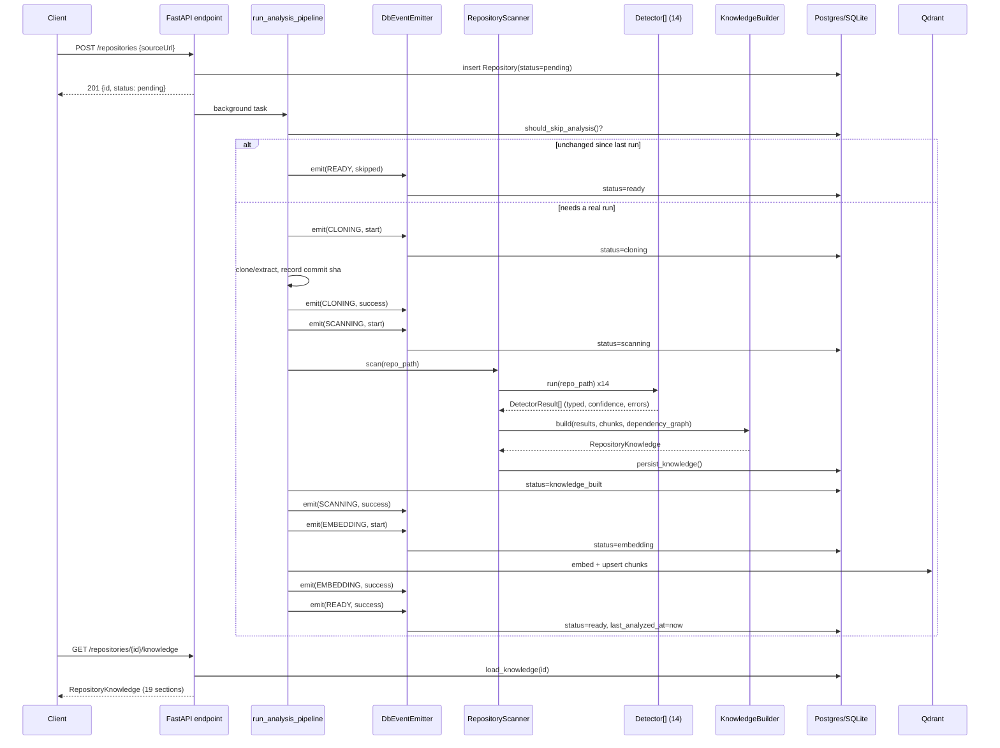
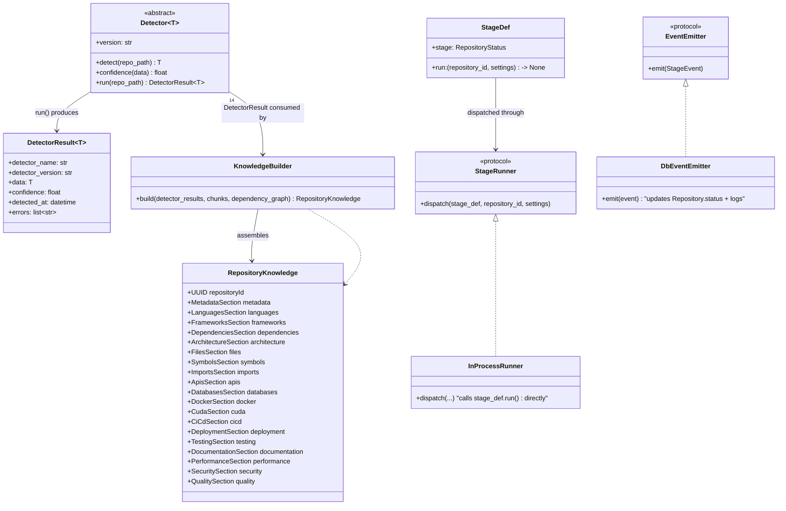

# RepoMind AI — Architecture

This document covers the **Repository Intelligence layer**: how a submitted repository becomes a
canonical `RepositoryKnowledge` object, and why every future consumer (chat, search, reports,
agents) reads *only* that object instead of the repository on disk. See [README.md](README.md) for
the product overview and [SETUP.md](SETUP.md) for running it locally.

## Pipeline overview

```
GitHub URL / ZIP upload
        │
        ▼
 POST /repositories  ──  creates a Repository row (status=pending), schedules a background task
        │
        ▼
 run_analysis_pipeline()  ──  the orchestrator (app/services/repository/analysis_pipeline.py)
        │
        ├─ should_skip_analysis()?  ── incremental short-circuit (see below) ── skip straight to READY
        │
        ▼
 CLONING        clone/extract, record the git commit sha (for future incremental checks)
        ▼
 SCANNING       every Detector runs against the repo path, tree-sitter parses source,
                the import graph is built, results are typed + confidence-scored
        ▼
 KNOWLEDGE_BUILT  Knowledge Builder assembles the 19-section RepositoryKnowledge object
                  (one best-effort LLM call fills in judgment fields only), persisted to the DB
        ▼
 EMBEDDING      chunks are (re-)parsed and embedded into Qdrant
        ▼
 READY  (or FAILED, from any stage, with the error recorded on the Repository row)
```

Every arrow is an isolated, typed step. Nothing deterministic is left to the LLM — languages,
frameworks, dependencies, Docker/CUDA/CI-CD/deployment/testing/API/database signals are all
extracted by dedicated detectors; the LLM only fills in judgment fields (architecture summary, use
cases, production readiness, difficulty, performance notes) that genuinely can't be derived
mechanically.

## Sequence diagram



## Class diagram



## Detector interface

Every detector (`app/services/repository/detectors/base.py`) implements one method, `detect(repo_path) -> T`
(a small Pydantic model specific to that detector), and inherits `run()` for free — which wraps the
result (or a captured error + safe default, if `detect()` raises) in a `DetectorResult[T]` envelope
carrying `detector_name`, `detector_version`, `confidence`, `detected_at`, and `errors`. 14 detectors
implement this: the original 7 (language, framework, dependency, package-manager, docker, cuda,
security) plus the README parser and 6 new lightweight ones (CI/CD, deployment, testing, API
surface, database, quality) — all reusing stdlib/regex/file-presence checks, no new dependency.

## Lifecycle

`RepositoryStatus`: `PENDING → CLONING → SCANNING → KNOWLEDGE_BUILT → EMBEDDING → READY`, or
`FAILED` from any stage. SCANNING and KNOWLEDGE_BUILT are one atomic unit of work in the current
in-process implementation (detector-running and knowledge assembly happen together, no LLM
streaming between them) — splitting them into two separately-dispatched stages would mean running
every detector twice just to get a status flicker, so the scanning stage makes one direct status
transition to `KNOWLEDGE_BUILT` right before returning, once persistence has actually happened. Both
statuses are still real, observed transitions backed by a single pass of work.

## Event-driven pipeline & the Celery/Redis extension point

`app/services/repository/pipeline/` decouples *what* each stage does from *how* it's dispatched:

- `StageDef` — a `(RepositoryStatus, run_fn)` pair. `run_fn` takes only `(repository_id, settings)`
  and opens its own DB session — no shared mutable state (no live `Session`/LLM `Runnable`) crosses
  a stage boundary, since those can't survive a future process/queue hop but `repository_id`/
  `Settings` can.
- `StageRunner` — the extension seam. `InProcessRunner` (today's only implementation) just calls
  `stage_def.run(...)` directly. A future `CeleryStageRunner.dispatch()` would do
  `celery_task.delay(...).get()` instead — **zero changes** to `PIPELINE`, any stage body, or
  `RepositoryStatus` are needed to make that swap.
- `EventEmitter` — `DbEventEmitter` is the sole implementation (one consumer exists; a listener
  registry is added only when a second one, e.g. a WebSocket push, is real). It updates
  `Repository.status`/`last_error`/`last_error_stage` and logs with `extra={repository_id, stage}` —
  the full "structured logging" ask, no new logging dependency for a single process with no
  aggregator yet.

One honest gap, deliberately not solved now: SCANNING's tree-sitter chunks are needed again by
EMBEDDING. Rather than passing them in-memory (which wouldn't survive a real queue boundary),
EMBEDDING re-derives them via `TreeSitterParser.parse(repo_path)` — cheap, deterministic, local CPU
— so the stage boundary is real *today*, not a "fix when we adopt Celery" TODO.

## Incremental re-analysis

Checked once, before the expensive clone: for git sources, a cheap `git ls-remote` (no clone)
compared against the commit sha recorded on the last successful run; for zip uploads, the sha256
computed at upload time compared against the stored hash. Any uncertainty (no prior run, remote
unreachable) means "run it fully" — never "skip". `POST /repositories/{id}/reanalyze?force=true`
bypasses the check entirely, for the case where the repo hasn't changed but a detector has (the
original motivating use case for the reanalyze endpoint). Deferred as future work: per-file
diff-based partial rescanning, incremental import-graph updates, chunk-level Qdrant diffing — all
need per-file hashing and a real diff algorithm, not justified until reanalysis volume is an actual
measured pain point.

## Database: normalized where it's actually queryable, JSON(B) where it's flexible

`languages`, `frameworks`, `dependencies` get real child tables (`repository_languages`,
`repository_frameworks`, `repository_dependencies`) — these are naturally many-to-one and
genuinely worth filtering/joining on later ("find every repo using Flask"). Every other section
(architecture, files, symbols, imports, apis, databases, docker, cicd, deployment, testing,
documentation, performance, security, quality) is one JSON(B) column on `repository_knowledge`,
round-tripped via that section's own `model_dump()`/`model_validate()` — their internal shape varies
too much to be worth a dedicated table yet, and 19 child tables for one refactor pass would be
premature normalization for facets nothing queries relationally today.

Those JSON(B) columns use `JSON().with_variant(JSONB, "postgresql")`: real `JSONB` (indexable,
queryable via `->>`) the moment `DATABASE_URL` becomes a Postgres DSN, plain `JSON` on SQLite today
— zero code change either way. **The DB is SQLite by default right now** (zero-setup dev, per
`app/core/config.py`), not Postgres — this refactor makes the schema Postgres-ready without forcing
that migration; flip `DATABASE_URL` whenever you're ready.

## What's explicitly deferred

- Celery/Redis itself — only the `StageRunner` seam exists; per the original ask, this refactor
  prepares the extension point, not the queue.
- A multi-listener event registry — `DbEventEmitter` is the only consumer that exists.
- Per-file diff-based incremental re-analysis — commit-sha/content-hash short-circuit only.
- A real static-analysis quality score — `QualitySection` is line/file/TODO counts, not complexity
  or maintainability metrics.
- Frontend UI panels for the code-intelligence endpoints (`/search`, `/explain`, `/files/{path}`) —
  types and API hooks exist; no visual components yet.
